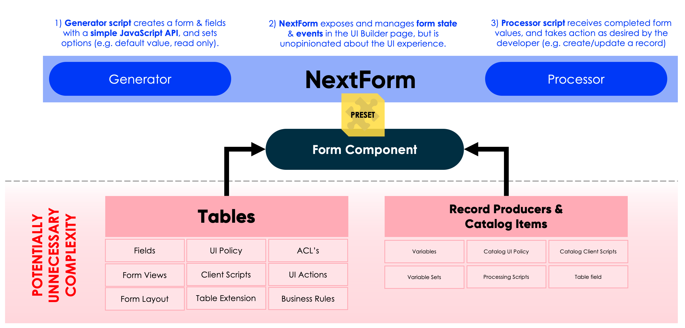
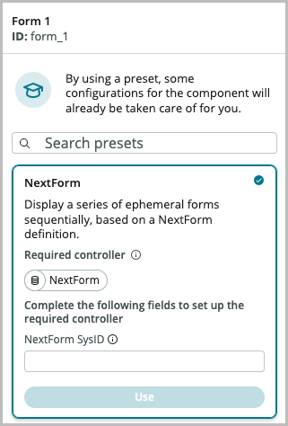

# NextForm
## What is NextForm?
NextForm is an application that allows you to easily create dynamic, ephemeral, UI-based forms in ServiceNow.

Previously, to create form displayed in the UI of ServiceNow you would either need to create a table, or create a record producer. Sometimes these methods are perfectly fine, however other times they can be more complex than needed. For example:

- If you create a table, it means you'll get all the overhead and complexity in your application that comes with them, such as ACL's, views, related lists, UI actions etc.
- If you create a record producer, you can only use it to create new records. They are not designed to support opening existing records and editing those values.

NextForm allows you to dynamically define a form that will only ever exist in the UI. The values for the form can be pre-populated with data sourced from the ServiceNow instance, and once completed the values can also be persisted into storage on the ServiceNow instance. However, how this generation of a form is done, and how one is processed, is completely left up to the developer leveraging NextForm.



NextForm's power comes from its Controller; it contains all the front-end logic to drive the experience. Using its [Preset](https://docs.servicenow.com/bundle/tokyo-application-development/page/administer/ui-builder/concept/presets.html) you can easily attach it to and configure a Form component. Simply add the Form component to your UI Builder page and you'll be offered to connect it to a NextForm with the prompt shown below:



In the **NextForm Sys ID** field, insert the **Sys ID** of a record in the **NextForms** [`x_snc_nf_nextform`] table and click **Use**. A NextForm has both a **Generator** and **Processor**.

## Generators
Generators are what creates the form that will be displayed by NextForm. They must return an `x_snc_nf.NextForm` object.

The NextForm object has a number of helper functions to allow you to define your form. Each function returns a reference to itself, so you can use method chaining to define forms in an expressive manner.

### The NextForm Generator API

#### NextForm
##### `new NextForm()`
Creates a `NextForm`. There are no parameters required.

##### `NextForm.addScreen()`
Add a screen to the NextForm. There are no parameters required.

##### `NextForm.addRow()`
A method to layout a screen. Adds a vertical row to the most recently created `NextScreen`, that columns can be placed inside. There are no parameters required.

##### `NextForm.addColumn()`
A method to layout a screen. Adds a horizontal column to the most recently created `NextRow`, that fields can be placed inside. There are no parameters required.

##### `NextForm.addField(x_snc_nf.NextField)`
Adds a field to the most recently created `NextColumn`. Accepts a `NextField` as its only parameter.

#### NextField
##### `new NextField(type, label, name, options)`
Creates a `NextField`. Accepts three mandatory parameters, and one optional:

###### type
Mandatory. The field type as a string. Current supported types are `string`, `integer`, `choice`, `dateTime`, and `boolean`. Depending on the type of field, different options may be supported.

###### label
Mandatory. The label for the field.

###### name
Mandatory. The internal name of the field. This must be unique across the entire NextForm.

###### options
Optional. An object with properties and values corresponding to the option for the field you want to set. The following options can be set:

```
{
    maxLength: 1400,
    choices: [{
        displayValue: "Option 1"
        value: "1"
    },{
        displayValue: "Option 2"
        value: "2"
    }]
}
```

### Example Generator Script

```
(function generateNextFormObject () {

    return new x_snc_nf.NextForm()
        .addScreen()
        .addRow().addColumn()
        .addField(new x_snc_nf.NextField("string", "What is your given name?", "name_given"))
        .addRow().addColumn()
        .addField(new x_snc_nf.NextField("integer", "What is your family name?", "name_family"))
        .addField(new x_snc_nf.NextField("choice", "What is your age?", "age", {
            choices: [{
                displayValue: "Under 18",
                value: "under_18"
            }, {
                displayValue: "18 and Over",
                value: "over_18"
            }],
            value: 'under_18',
            displayValue: 'Under 18'
        }))
        .addColumn()
        .addField(new x_snc_nf.NextField("dateTime", "When did you last sleep?", "sleep"))
        .addField(new x_snc_nf.NextField("dateTime", "When did you last wake up?", "wake"))
        .addScreen()
        .addRow().addColumn()
        .addField(new x_snc_nf.NextField("textarea", "Tell me about yourself?", "details", {
            maxLength: 4000
        }))
        .addScreen()
        .addRow().addColumn()
        .addField(new x_snc_nf.NextField("boolean", "Would you like to receive marketing communications?", "marketing_allowed"));

})();
```

## Processors
Processors process the user response for a form as required by the form developer.

The `nfData` object contains properties for each of the fields that were created in the Generator script. In those properties, you can access the `value` and `displayValue` that was set for those fields.

### Example Processor Script

```
(function processNextFormResult (nfData) {
	
	gs.info('NextForm Processed! ' + JSON.stringify(nfData));
	
	gs.info("The user's family name was: " + nfData.name_family.displayValue);

})(nfData);
```

## NextForm Controller
The NextForm Controller is automatically added to the UI Builder page when the NextForm Preset is applied to the Form component. You can find it in the **Data Resources** panel.

### Output Properties
The NextForm Controller manages the state of the form, and outputs properties to allow UI Builder page developers to build a UI that controls the form.

| Property            | Type    | Description                                                                                                                   |
|---------------------|---------|-------------------------------------------------------------------------------------------------------------------------------|
| nextFormData        | JSON    | A JSON representation of the NextForm object returned by the Generator script.                                                |
| fields              | JSON    | All the fields of the NextForm in their JSON representation. Fed into the fields property of the Form component.              |
| currentSections     | JSON    | The current screen of the NextForm in JSON representation. Fed into the sections property of the Form component.              |
| currentScreenNumber | Integer | The 1-indexed (starting at 1) form of the current screen number. Used for UI display of the current screen.                   |
| currentScreenIndex  | Integer | The 0-indexed (starting at 0) form of the current screen number. Used for programmatic access to the current screen.          |
| screenCount         | Integer | The total number of screens.                                                                                                  |
| canGoFirst          | Boolean | Whether it is possible to change to the first screen (e.g. true if on second screen, false if already on the first screen)    |
| canGoLast           | Boolean | Whether it is possible to change to the last screen (e.g. true if on second-last screen, false if already on the last screen) |
| canGoNext           | Boolean | Whether it's possible to change to the next screen. True if not already on the last screen.                                   |
| canGoPrevious       | Boolean | Whether it's possible to change to the next screen. True if not already on the first screen.                                  |
| canGoIndex          | Boolean | Whether it's possible to change screens. True if there is more than 1 screen.                                                 |
| isLoading           | Boolean | Whether NextForm is doing any kind of loading operation (e.g. initial load, processing)                                       |
| canReset            | Boolean | Whether the NextForm can be reset to its default values.                                                                      |
| canProcess          | Boolean | Whether the NextForm can be processed. True if on the last screen, and not already processed.                                 |
| isLoaded            | Boolean | Whether the initial load of the NextForm has completed.                                                                       |
| isProcessed         | Boolean | Whether the form has already been processed.                                                                                  |


### Handled Events

| Name                           | Description                                                                      | Parameters                                                                                                                                |
|--------------------------------|----------------------------------------------------------------------------------|-------------------------------------------------------------------------------------------------------------------------------------------|
| [Screen] Change Current Screen | Navigate to a specified screen number (1-indexed)                                | Screen number [screen_number]: the 1-indexed number of the screen to navigate to.                                                         |
| [NextForm] Process             | Submits the field values of the NextForm to the Processing script on the server. |                                                                                                                                           |
| [Field] Set Value              | Sets a specified field's value and display value.                                | Field [field]: The name of the field to set the value of Value [value]: The new value Display value [displayValue]: The new display value |
| [NextForm] Reload              | Reset the NextForm's fields to have all their default values.                    |                                                                                                                                           |
| [Screen] Go To First Screen    | Navigate to the first screen (if not already on it)                              |                                                                                                                                           |
| [Screen] Go To Last Screen     | Navigate to the last screen (if not already on it)                               |                                                                                                                                           |
| [Screen] Go To Next Screen     | Navigate to the next screen (if possible)                                        |                                                                                                                                           |
| [Screen] Go To Previous Screen | Navigate to the previous screen (if possible)                                    |                                                                                                                                           |

### Dispatched Events

| Name                            | Description                                      |
|---------------------------------|--------------------------------------------------|
| [NextForm] Processing completed | When the processing of a NextForm has completed. |
| [NextForm] Field value changed  | When the value of a field has changed.           |
| [NextForm] Processing started   | When the processing of a NextForm has started.   |
| [NextForm] Loading completed    | Once the intial load of the form has completed   |